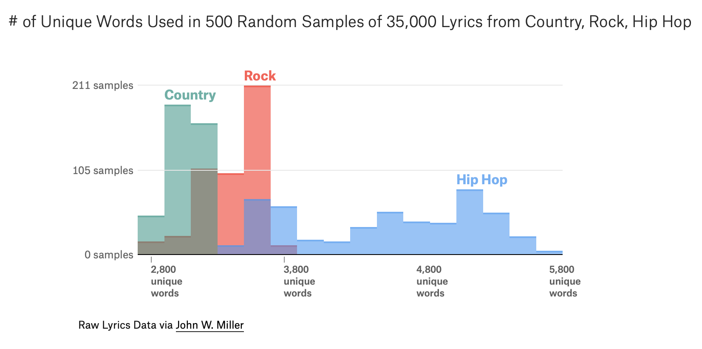
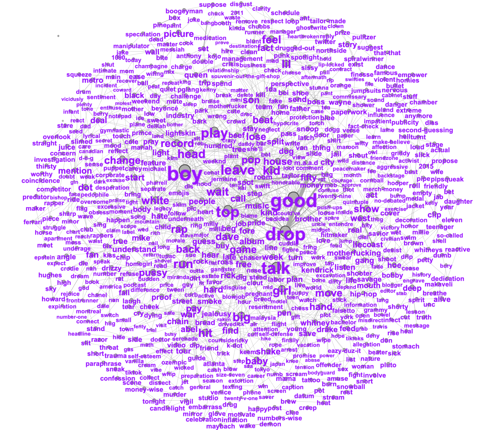
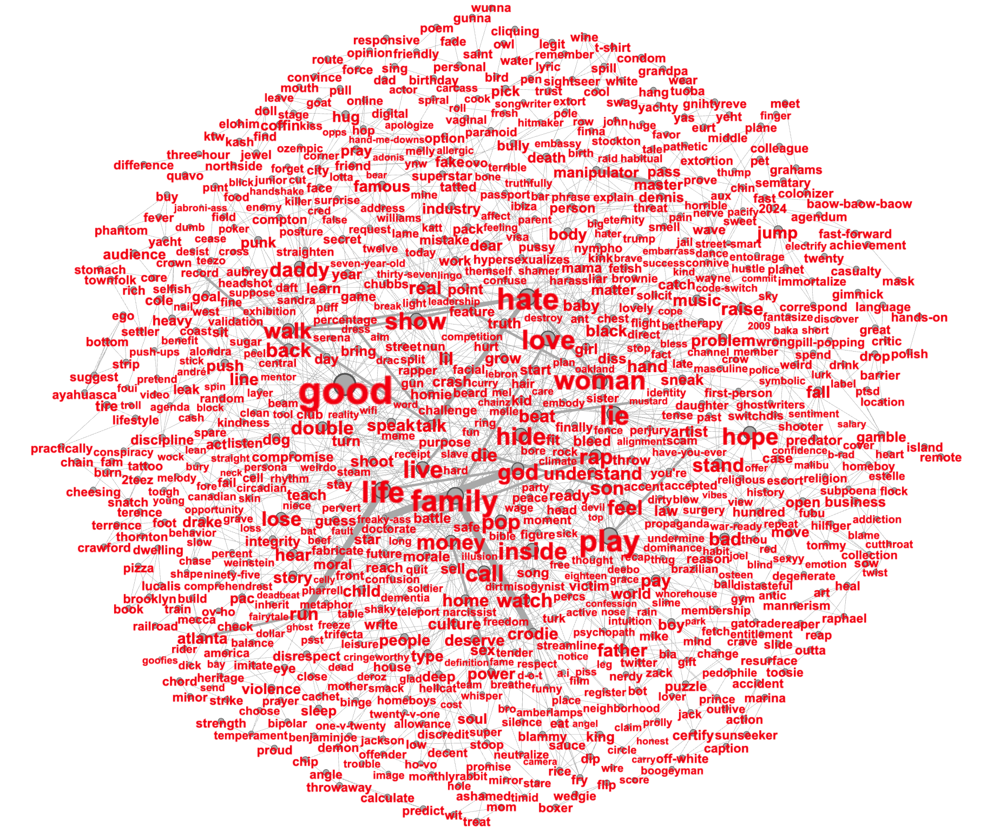
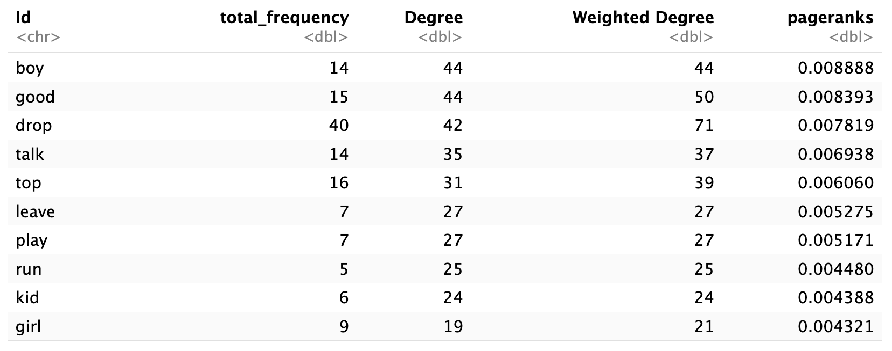
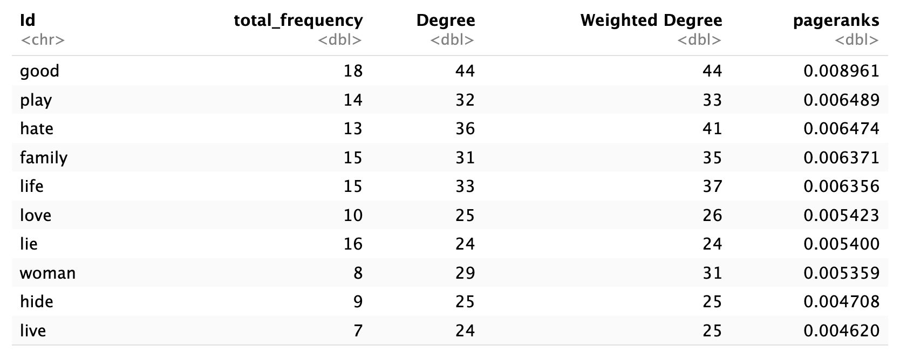

```{r, echo=FALSE, message=FALSE}
library(tidyverse)
library(tidytext)
library(widyr)
library(textstem)
library(DescTools)
```

```{r, echo=FALSE, message=FALSE}
lyrics <- read_csv("../data/diss_tracks.csv")
```

## Introduction



Rap music is notable for its lyrical complexity. And among rappers, Kendrick Lamar's "conscious" music has a reputation for lyricism and thematic density. My goal with this project was to use the tools of network science to analyze Kendrick's discography and see if the algorithms could uncover patterns that my ears were unable to. Though my initial attempts were unsuccessful, after pivoting away from a comparison of his music with itself to a comparison between him and a competitor, I was able to glean some interesting insights. Specifically, I analyzed the 2024 Kendrick Lamar-Drake feud, where each released several "diss tracks" criticizing the other over music, fashion, fitness, and most of all, their personal lives.

The diss war was perhaps the defining cultural event of 2024 here in the US. As a brief summary, the rivalry had been stewing ever since Kendrick's braggadocious verse on 2013's "Control", where he name-dropped a dozen rappers, including Drake. During the ensuing decade, they traded "sneak disses", obliquely making fun of each other without dropping names, until the battle really broke out in earnest with Kendrick's appearance on Future and Metro Boomin's single "Like That", released on March 26, where he rejected the common idea that there's a "Big 3" in modern rap of Drake and J. Cole alongside himself. The first response came from J. Cole on April 5th. Entitled "7 Minute Drill", the diss was widely ridiculed, and he took it down just two days later, issuing an apology to Lamar. Drake however was not put off, and dropped his first shot, "Push Ups", on April 19, alongside the more controversial "Taylor Made Freestyle", which featured AI-generated vocals from the deceased West Coast icon 2Pac. This prompted Lamar to respond with the surgical "euphoria" on April 30.

Things reached a boiling point on May 3. First, Kendrick dropped his second diss in a row with "6:16 in LA." Later that day, Drake responded with "Buried Alive Interlude pt. 2", referencing Lamar's feature on his 2012 Take Care, and then the seven-minute "Family Matters." Finally, just twenty minutes after that, Kendrick fired yet another shot with "meet the grahams." May 4, however, would prove to be the turning point. "Not Like Us" became a smash hit and the defining moment of the beef. When Drake's response the next day, "The Heart Part 6", recieved a lukewarm reaction, the war came to an end, and most analysts, including Rolling Stone, Pitchfork and The New York Times, declared Lamar the winner.

While much of the war was characterized by wild, unsubstantiated allegations of adultery, pedophilia and secret children, there were substantive differences between the rivals. For many, Kendrick Lamar represents the "conscious" side of hip-hop, focusing on important themes of racism and poverty in his lyrics, whereas Drake represents the "commercial" side, focused on party "bangers," though Lamar certainly has his hits and Drake has his more vulnerable tracks. It would be an interesting future project to try to compare the entire discographies of the two, but given the time constraints I wanted to focus just on the diss tracks themselves. My goal was to analyze their lyrics for notable similarities and differences, and hopefully be able to crown a winner at the end. In doing so, I tried to be as objective as I can, though it's probably evident that I'm a bit biased. But hopefully the results will largely speak for themselves.

## Background

A major inspiration for the direction this project ultimately took was Matt Daniels' 2014 (updated in 2019) analysis of the vocabulary of hundreds of rappers. Using each artist's first 35,000 lyrics, he essentially calculated the "type-token ratio" by counting the number of unique words, obtaining a broad range from less than 3,000 to more than 7,000. It tracks pretty well onto the reputation of artists as more thoughtful having larger vocabularies and more pop-oriented artists on the lower end, and there's also a strong temporal dimension, with a consistently decreasing vocabulary from the '90s through the 2000s and into the 2010s, as rap became fully mainstream. However, I was surprised to see Kendrick Lamar slightly below average at 4,017 words, though a dense vocabulary isn't strictly necessary for thematic depth.

Daniels' project was a great data-driven exploration of similar ideas that I was interested in, but whereas he took a broad survey of the entire genre, I wanted to drill deep into the discography of just one of my favorite artists. To do this, I had to familiarize myself with several tools from the natural language processing toolkit. One really important tool is "stop word" filtering. Stop words are filler words that give us little information in the context of what we're trying to analyze. Universal stop words are articles and conjunctions such as "the", "of" and "as", but there are also more nebulous categories, such as pronouns and generic verbs, that sometimes are useful and sometimes not. So NLP researchers will often employ a standard dictionary and sometimes a small custom dictionary tailored to the context.

In this context, my custom dictionary is necessarily quite large, because there are a lot of rap-specific stop words. However, I also utilized the standard SMART dictionary through the tidytext package, first published by David Lewis, Yiming Yang, Tony Rose and Fan Li. While their paper, "RCV1: A New Benchmark Collection for Text Categorization Research", is quite academic and outside my area of expertise, I found the dictionary very helpful as a starting point for cleaning my data.

## Methods

My initial idea was to explore Kendrick Lamar's discography by creating a network of his songs as the nodes and connecting them if they were lyrically similar. I was drawn to this topic for two reasons: one, I'm a big fan of his music, and two, while I can tell myself which songs are sonically similar, the lyrics are dense and cover a wide range of topics, so the tools of network science might be able to uncover relationships that my ears are unable to. I should note that I received significant assistance from Google's Gemini chatbot in running nlp algorithms I was unfamiliar with, scraping my data and creating the proper regex filters to clean it.

For the data, Gemini helped me write a scraper that collected lyrics from Genius for 108 Kendrick Lamar songs. Unfortunately, they came through very messy, with extraneous content such as comments and "Chorus" or "Verse" tags as well as all sorts of missing line breaks causing words to smush together, so the chatbot and I developed an intricate regex filtering method to get everything back in its right place. Once the data was in decent shape, I utilized OpenAi's embedding algorithm to generate a similarity matrix for 108 songs, and readied it for Gephi by setting the edge inclusion threshold to a manageable level.

Lamar is noted for having very distinctive-sounding albums, so I was hoping to see strong communities roughly corresponding with those albums, but was dissappointed to observe a weak relationship, with Gephi unable to detect communities anywhere close to his actual albums. My next thought was to shift focus from album communities to chronological ones, dividing his work into three eras which to my ear are relatively distinct. However, I once more observed only a weak relationship, with a p-value of 0.092 between my eras and the three communities detected by Gephi.

These results led me to conclude that Lamar's discography was just too diverse to be categorized so neatly, with him covering a broad range of topics on each individual album, which was an interesting finding counter to what I had expected. However, I was still disappointed to not have a nice-looking network, so I decided, since I had all the data, I might as well try one more pivot. If I couldn't compare Kendrick Lamar to himself, I just had to try to compare him to the competition. A broad, genre-wide survey of the sort undertaken by Daniels was infeasible at this point, so I narrowed my focus to a single competitor. And given the context of recent events, there was only one competitor that could be.

## Results

As it turned out, the diss tracks were the perfect dataset for a slightly different kind of analysis. As each rapper has five songs for ten total, a song network no longer works, but instead I could look at common words. Now the goal is to create a network of words, one for each artist, and connect them if they appear in the same line. This should tell us both which concepts are most prevalent, and which appeared most often together. If one has a notably higher average degree than the other, then more concepts are getting connected. We can also look at metrics such as diameter and average path length to see how cohesive their arguments are. Finally, we can attempt a qualitative analysis by comparing the most prominent nodes.

The initial dataset was created by scraping lyrics from Genius and combining them into a dataframe with three columns: artist, track_name and lyrics. Then, to get just the words, I separated each word from each lyric into its own column, marking the line by the presence of the newline character. Next, I simply split this in two by artist. Looking at these new, much smaller datasets, if we apply the metric from the Daniels article, we see that Lamar had 1,262 unique words out of 4,441 total among his five songs, whereas Drake had 1,236 out of 4,476, nearly identical ratios. This is unsurprising in a relatively small sample (by contrast, Daniels looked at 35,000 words per artist).

```{r,echo=FALSE,message=FALSE}
kendrick <- lyrics %>% filter(artist == "Kendrick Lamar")
drake <- lyrics %>% filter(artist == "Drake")
```

```{r,echo=FALSE}
print("Kendrick's words:")
kendrick_words <- kendrick %>%
    unnest_tokens(line, lyrics, token = "regex", pattern = "\n") %>%
    mutate(line_id = row_number(), chunk_id = ceiling(line_id / 3)) %>%
    unnest_tokens(word, line)

kendrick_words %>% 
  group_by(word) %>% 
  count()
```

```{r,echo=FALSE}
print("Drake's words:")
drake_words <- drake %>%
    unnest_tokens(line, lyrics, token = "regex", pattern = "\n") %>%
    mutate(line_id = row_number(), chunk_id = ceiling(line_id / 3)) %>%
    unnest_tokens(word, line)

drake_words %>% 
  group_by(word) %>% 
  count()
```

As we can see, there's a lot of cleaning to be done. Anti-joining the SMART dictionary was a great start, but since it was created in an academic context, there are plenty of common rap words that didn't make it in. I dealt with these in two ways; one, a blanket ban on every word less than three characters (hitting "um", "ay", "oh", etc.), and two, a custom dictionary including slang, profanity and a small number of generic verbs ("gonna", "wanna", "shoulda", etc.). An important step before applying this was to "lemmatize" the words down to just their roots. For example, "give", "giving", "given" and "gives" all end up as "give." This was also really easy thanks to the textstem package, just a single line of code. This method introduced a level of subjectiveness into the process, but it was largely necessary as there's no well-defined way to get down to just the substantive words, and a couple changes on the margin would not meaningfully effect the networks.

With this process done, we have our final datasets of 834 words for Kendrick and 803 for Drake. Out of the original, this represents a proportion of 18.8% of the original words for Kendrick and 17.9% for Drake, a small and probably not meaningful difference.

```{r,echo=FALSE}
# 1. Load the SMART academic stopword list
smart_stops <- stop_words %>% filter(lexicon == "SMART")

# 2. Build the Network Function
build_artist_network <- function(data, target_artist, edge_file, node_file, words=FALSE) {
  
  df_clean <- data %>%
    filter(str_to_lower(artist) == str_to_lower(target_artist)) %>%
    mutate(lyrics = str_remove_all(lyrics, "\\[.*?\\]")) %>% 
    mutate(lyrics = str_remove_all(lyrics, "'s\\b|’s\\b")) %>%
    mutate(lyrics = str_replace_all(lyrics, "in['’](?![a-zA-Z])", "ing")) %>%
    mutate(lyrics = str_replace_all(lyrics, "(?<=[a-zA-Z])-(?=[a-zA-Z])", "_"))
  
  word_data <- df_clean %>%
    unnest_tokens(line, lyrics, token = "regex", pattern = "\n") %>%
    mutate(line_id = row_number(), chunk_id = ceiling(line_id / 3)) %>%
    unnest_tokens(word, line) %>%
    mutate(word = lemmatize_words(word)) %>%
    
    # Rule 1: Must be 3 characters or longer
    filter(nchar(word) >= 3) %>%
    
    # Rule 3: Apply the SMART Stopword Lexicon
    anti_join(smart_stops, by = "word") %>%
    
    # Rule 4: The Domain-Specific List (Hip-Hop specific filler)
    # It is standard science to add a SMALL, documented list of industry jargon
    filter(!word %in% c("yeah", "nigga", "niggas", "gonna", "gotta", "wanna", "cause", "y'all", "ayy", "fuck", "bitch", "shit", "time", "man", "bout", "til", "hey", "huh", "make", "take", "come", "ass", "wop", "gon", "lot", "motherfuck", "tryna", "put", "i'ma", "shoo", "mmm", "ooh", "bee", "niggas'll", "dawg", "give", "woulda", "mm_mm", "ayy_ayy", "should've", "must've", "shit'll", "you're", "baow-baow-baow", "whoop", "bullshit")) %>% 
    mutate(word = str_replace_all(word, "(?<=[a-zA-Z])_(?=[a-zA-Z])", "-"))
  
  # Create the edges
  word_edges <- word_data %>%
    pairwise_count(word, line_id, sort = TRUE, upper = FALSE) %>%
    rename(Source = item1, Target = item2, Weight = n) %>%
    filter(Weight >= 1) 
  
  # Create the nodes
  word_nodes <- tibble(Id = unique(c(word_edges$Source, word_edges$Target))) %>%
    mutate(Label = Id) %>%
    left_join(word_data %>% count(word), by = c("Id" = "word")) %>%
    rename(Total_Frequency = n)
  
  print(nrow(word_nodes))
  
  write_csv(word_edges, edge_file)
  write_csv(word_nodes, node_file)
  print(paste("Successfully created network files for:", target_artist))
  if (words) {
    return(word_nodes) 
  }
}
```

```{r,echo=FALSE}
kendrick_words <- build_artist_network(lyrics, "Kendrick Lamar", "kendrick_edges.csv", "kendrick_nodes.csv", words=TRUE)
drake_words <- build_artist_network(lyrics, "Drake", "drake_edges.csv", "drake_nodes.csv", words=TRUE)
```

```{r,echo=FALSE}
print("Drake's filtered words:")
drake_words %>% 
  arrange(Id) %>% 
  head(10)
```

```{r,echo=FALSE}
print("Kendrick's filtered words:")
kendrick_words %>% 
  arrange(Id) %>% 
  head(10)
```

We can see that the filtering has done a good job filtering down mostly to meaningful nouns and verbs. And now that the chaff has been removed, all that's left is to create the node and egde datasets before sending them off to Gephi. Applying the Fruchterman-Reingold and Label Adjust algorithms, and weighting node and label size by PageRank importance, I produced these networks:





If you focus on the biggest words, you might notice a striking tonal dichotomy. Indeed, if we look at the top 10 words for each by PageRank, it becomes even more obvious.





Both rappers made very frequent use of "good" and "play", but beyond that it is night and day. Where Drake has "boy", "girl", and "kid", Kendrick has "man", "woman" and "family". Drake's verbs: "drop", "talk", "leave", "play" and "run." Kendrick's verbs: "play", "hate", "love", "lie", "hide", "live". This clearly illustrates the completely different attitudes the rappers took into the diss war. Whereas Drake tries to paint Kendrick as an annoying little kid and laugh him off, Kendrick is dead serious, laying bare his true contempt and hatred for his rival. Kendrick's focus on family highlights a sore spot for Drake: in a 2018 feud, he was humiliated by the Virginia rapper Pusha T's revelation that he was hiding a son who he planned to reveal as part of an Adidas ad campaign. Even the common word "play" comes off differently when each says it: light-hearted for Drake, and darkly ironic for Kendrick.

Despite their qualitative differences, though, I was dissappointed in my effort to draw quantitative conclusions. Both artists exhibit remarkable similarity in all the network metrics I employed. First, I checked to see how well-connected each network was. The structure of both networks is a giant component surrounded by 2-5 node islands of isolated lines of unique words. More of those islands represents a less coherent argument, but both had exactly 81.4% of the nodes in the giant component. I also ran Gephi's modularity algorithm to detect communities, but neither produced very meaningful clusters.

Another way to measure cohesion is to look at paths. A shorter diameter and average path length indicates that the rapper more tightly clustered the ideas in their lyrics, as opposed to random, one-off attacks. However, the diameter for both was 10, and the average path lengths within 0.02: 4.483 for Drake and 4.463 for Kendrick. Finally, higher average degree indicates that a rapper was able to squeeze a higher proportion of meaningful words as opposed to filler into their lines. Once more, we have an effective tie: average degree of 4.631 and average weighted degree of 4.705 for Kendrick versus 4.697 and 4.902 for Drake. Given the tonal dichotomy, it is remarkable how structurally similar both artist's diss tracks were.

## Conclusion

Can we declare a winner? Unfortunately, the results are not as clear-cut as I had hoped. The similarity of the numeric metrics makes it difficult to draw especially objective conclusions. However, the tonal difference is at least an interesting finding, and if it doesn't provide much ammunition for one side or the other on its own, I think it can partially explain why Kendrick was largely understood to be the winner at the time.

He chose to start the war with his inflammatory verse on "Like That" with a purpose. Partly, he must have seen the potential benefits to himself in terms of notoriety and attention, but he also expresses genuine distaste for Drake and the style of music he has propagated. He wanted to take Drake to task for his more commercial style, especially given that his last few album topped the charts but were poorly-reviewed, and he also wanted to reject the idea of the "Big 3", implying that such work was equally valuable with his own more experimental and critically acclaimed music. By contrast, Drake was sort of caught off guard, and didn't really have a compelling response, so he mostly just tried to laugh it off. But Kendrick Lamar is too talented to simply be laughed off, and he proved that even with his more introspective image he had a better understanding of the culture they both operate within.

As far as future extensions of this work, I mentioned it would be interesting to compare the two across their entire careers, rather than focusing on just the diss tracks. While we would lose the really nice apples-to-apples comparison of five songs each trying to achieve the same goal, it would be a more rigorous way to examine whether the commercial/conscious distinction can so cleanly be applied to the rivals. Thankfully, with the data extraction and cleaning pipeline largely generalizable, this project would not be too difficult to undertake, though I'm not sure if and when I will have the time to do it.

## References

["The Largest Vocabulary In Hip Hop"](https://pudding.cool/projects/vocabulary/index.html)

["RCV1: A New Benchmark Collection for Text Categorization Research"](https://www.jmlr.org/papers/volume5/lewis04a/lewis04a.pdf)
